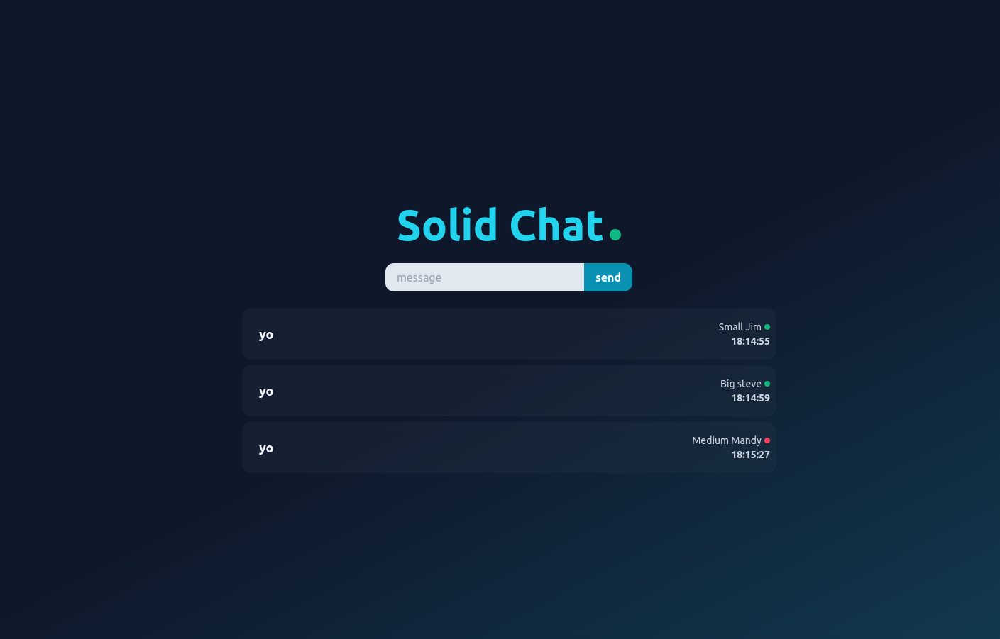

# Solid Chat

Simple websocket chat app using Solid JS frontend and Websocket API backend.
For learning purposes.



## Usage

Requirements:
- NodeJs 16+
- pnpm

```bash
pnpm i
pnpm wss
# In another terminal
pnpm dev
```

## Future Plans for more knowledge

- [x] Add SolidJs
- [ ] Add Storybook tests
- [ ] Add Playwright tests

## Things to keep in mind when developing with Solid JS

- Never destructure props. You will lose reactivity (for non Signal Accessors e.g. signal value or static value)
- States cannot be dynamically created in effects. They must be created at the top level of the component.
- Prop drilling for Signals can be either pass by value or pass by accessor. [Relevant reading](https://github.com/solidjs/solid/discussions/749)